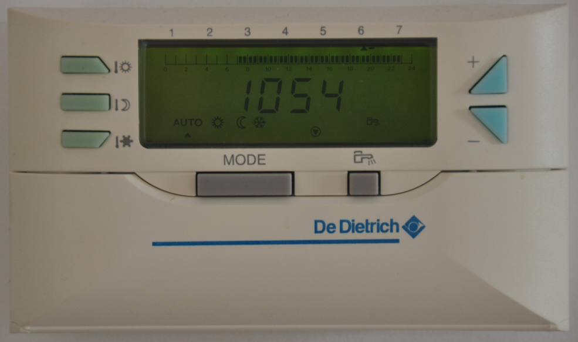
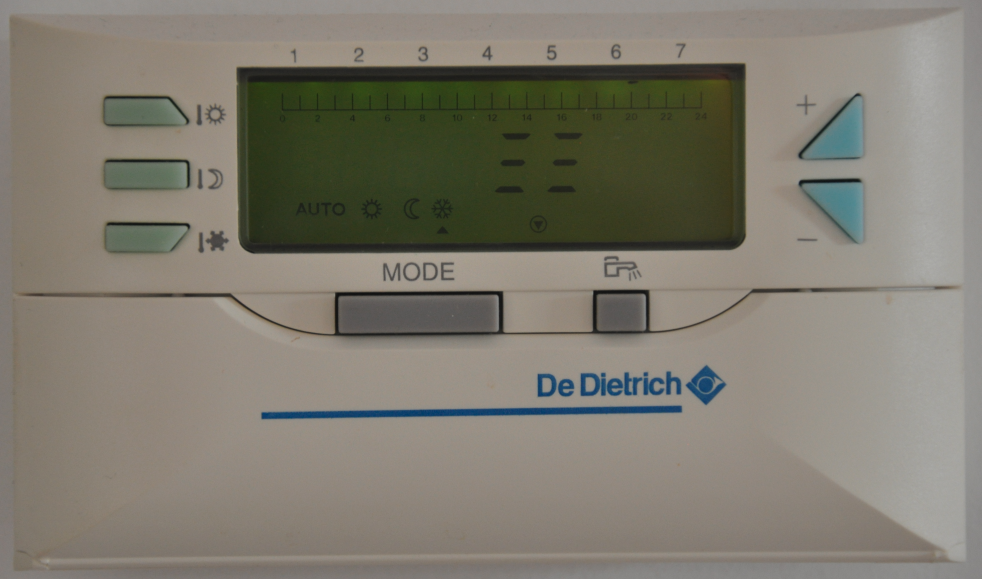

<h2>Making of a MQTT interface for a De Dietrich boiler fitted with a Diematic 3 regulator</h2>

The goal is to be able to control boiler's general setting with a smartphone using a MQTT client or through a domotic software.

Reminder : Diematic 3 regulator has a built-in control board like :

And a remote control board like :

I remind that if you use information and software available in this repository, It's mean that you feel enough qualified to manage what you are doing and its impacts.

<h2>General Design</h2>
<h3>ModBus Interface Description</h3>

Diematic 3 regulator is fitted with a ModBus interface which allows to read and modify measures and parameters.

There's very few doucmentation on the specification of the De Dietrich ModBus implementation. Used documents can be found on the web by using key words "diematic modbus register"

ModBus rely on data exchange on a serial bus. The Diematic 3 implementation is done with following details :

    RTU (binary) mode, on a RS485 bus
    9600 bauds, 8 bits, no parity, 1 stop bit
    boiler address is 0x0A (hexadecimal)

One specifity of the De Dietrich implementation is the dual-master :
    The boiler transmit ModBus command during 5s as a ModBus master and then remain silent during 5 next seconds  waiting for possible ModBus commandas slave (address: 0x0A).

This particularty will have some impact on the behviour of our system : reponse time will be between 5 and 10 s (5s waiting for boiler slave mode followed by the data transmission).

My main requirements to design the solution were:
- to not spend too much time
- to not spend too much money
as at the beginning I was not sure to achieved something usable.

It's why I chose to use following elements :
- an interface card USR-TCP-232-24, replaced later by an USR-TCP-232-306 which is delivered in an enclosure and has bigger range for power supply voltage. USR-TCP-232-306 specifications can be found on USR-IOT website and bought averywhere. The interface RS485 port is connected on the ModBus port of the Boiler on on side and to the LAN on the other side. If you need it, you can use some WIFI version.
- a Raspberry with raspian installed and Python 3.6 or more. Python script have been tested with python 3.8. A diffculty with Raspberry is to no corrupt the SD card on power loss. I've solved this issue using a backup battery. If you've a NAS already robust agains that kind of problem, you also be able to use it.
- a MQTT broker, which can be installed on the same raspberry or elsewhere
- some python scripts to send commands received as MQTT messages to the boiler, and provide boiler status always through MQTT messages.

Internet box settings to allow external access to the NAS while complying with good security practice wont be described here. Several solutions can be used according your paranoid level.

<h2>Making of</h2>
<h3>Wiring</h3>

You can start with wiring the USR-TCP-232-306 to the boiler using a 2 wire cable and a mini DIN connector with four pins. The cable schematic is below:

<h3>Module settings</h3>
You can now go on with setting the USR-TCP-232-306  module with a standard web brother :

Remark : I let you read the doc to configure IP parameters of the USR-TCP-232-306. The TCP server address of the above page is not used

<h3>Python script deployment</h3>

Python pytz module is needed.

Script are available [here](src/)

You just need to copy file in a choosen directory.
You need to configure Diematic32MQTT.conf file with :
- ip address of the USR module
- port of the module (20108 by default)
- MQTT broker address and port 
- MQTT topic root if you want to modify the default one
- timezone to be use for boiler clock setup feature

You can also configure the log level in the logging.conf file.
To run the script you just have to launch python3 Diematic32MQTT.py

You can follow log in real time with:

tail -f log.out

<h3>To display MQTT message send</h3>
Use mosquitto_sub command:

mosquitto_sub -h localhost -v -t 'home/#'

Remark: as modbus switch between slave and master mode, you may have to wait up to 10s to have your command taken into account

<h3>To send MQTT message to the boiler</h3>
Use mosquitto_pub command. Exemple, to set the regulator in temporary day mode:

mosquitto_pub -h localhost -t home/heater/boiler/zoneA/mode/set -m 'TEMP JOUR'

List of MQTT message topics to set temperatures is :
- home/heater/boiler/hotWater/dayTemp/set
- home/heater/boiler/hotWater/nightTemp/set
- home/heater/boiler/zoneA/dayTemp/set
- home/heater/boiler/zoneA/nightTemp/set
- home/heater/boiler/zoneA/antiiceTemp/set
- home/heater/boiler/zoneB/nightTemp/set
- home/heater/boiler/zoneB/antiiceTemp/set

exemple:

    mosquitto_pub -h localhost -t home/heater/boiler/zoneA/dayTemp/set -m 21.0

List of MQTT message topics to set modes is :

- home/heater/boiler/hotWater/mode/set
- home/heater/boiler/zoneA/mode/set
- home/heater/boiler/zoneB/mode/set

Available modes for zone A & B are (sorry they are in french, but still easy to understand):
- AUTO
- TEMP JOUR
- TEMP NUIT
- PERM JOUR
- PERM NUIT
- ANTIGEL

Available modes for hotwater are (sorry they are in french, but still easy to understand):
- AUTO
- TEMP
- PERM
- 
exemple:

    mosquitto_pub -h localhost -t home/heater/boiler/zoneA/mode/set -m 'PERM_NUIT'
    mosquitto_pub -h localhost -t home/heater/boiler/hotWater/mode/set -m 'TEMP'

To synchronize the boiler clock to the interface clock:
- home/heater/boiler/date/set

Unique value is :
- Now

exemple:

    mosquitto_pub -h localhost -t home/heater/boiler/date/set -m 'Now'

<h3>To use client Dash MQTT for android</h3>

With this [client](https://play.google.com/store/apps/details?id=net.routix.mqttdash&hl=fr&gl=US) you can get easily custom dashboard like this one:

To import exemple of Tiles :
- after installation, add a new connexion to your MQTT broker, and select it
- clic on the double arrow icon on the top banner
- clic on "Suscribe and wait for metrics" button

Get the MQTT_Dash/Tiles.txt file and then use following command:

    mosquitto_pub -h localhost -t metrics/exchange -f Tiles.txt

<h3>To run as a service under Raspbian</h3>

as root, copy and adapt (varying choosen file directory) Diematic32MQTT.service to /etc/systemd/system/ directory

    sudo chmod 644 /etc/systemd/system/Diematic32MQTT.service
    chmod +x Diematic32MQTT.py
    sudo systemctl daemon-reload
    sudo systemctl enable Diematic32MQTT.service
    sudo systemctl start Diematic32MQTT.service

<h3>Limitations</h3>

With this release 313 (boiler bought end of 2006), some limitations has been solved with sometimes the help of workaround. Temporary anti freezing, is no more available as it was not correctly settable through the Diematic 3 Modbus interface, but permanent antifreezing mode has replaced it. Notice that, in this case the remote control shows below display, which is normal (you can get it with the mode button selecting antifreeze during 5s) :

Main found limitations of the Diematic 3 interfaces are :
- update of remote display heating mode not updatable without "heavy" workaround
- no possibility to switch between programs (P1..P4)
- Pump ECS (water heater) info not robust
- no possibility to use without issue temporary freezing mode
- pump power stays at 100% when all pumps are off

For further info you can go to [Fibaro forum](https://www.domotique-fibaro.fr/topic/5677-de-dietrich-diematic-isystem/)
